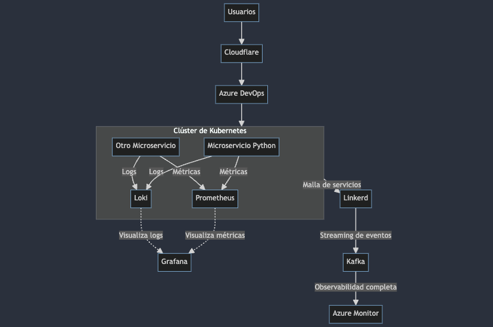

# Repositorio para el Despliegue de Microservicios en K8s

## Estructura

```
microservice/
├── diagrams/
│   └── observability-diagram.png
├── k8s/
│   ├── namespace.yaml
│   └── python_app.yaml
├── test/
│   ├── requirements-dev.txt
│   └── test_app.py
├── app.py
├── azure-pipelines.yml
├── cloudflare-worker.js
├── Dockerfile
├── requirements.txt
└── README.md
```

## Archivos

- `Dockerfile`: Archivo Dockerfile para el microservicio en Python.
- `k8s/python_app.yaml`: Archivo YAML de Kubernetes para el pod.
- `k8s/namespace.yaml`: Archivo YAML para la creación de namespace.
- `azure-pipelines.yml`: Archivo YAML para el pipeline de Azure DevOps.
- `cloudflare-worker.js`: Script de Cloudflare Worker para redimensionar y cachear imágenes.
- `diagrams/observability-diagram.png`: Diagrama de observabilidad.
- `test/requirements-dev.txt`: Contiene las dependencias necesarias para las pruebas y el desarrollo.
- `test/test_app.py`: Contiene las pruebas unitarias para la aplicación Flask.

## Configuración

### Dockerfile

- **Prepara el entorno**: Utiliza una imagen base oficial de Python 3.9 (`python:3.9-slim`) y establece el directorio de trabajo en `/app`.
- **Copia los archivos y instala dependencias**: Copia `requirements.txt` y `app.py` al contenedor e instala las dependencias listadas en `requirements.txt`.
- **Configura y ejecuta la aplicación**: Expone el puerto 80 y define el comando para ejecutar la aplicación (`python app.py`).

### YAML de Kubernetes

- **namespace**: Configurado como `tech.prod`.
- **memory limit**: Configurado en 3Gi.
- **network**: Configurado como `internal prod`.

### Pipeline de Azure DevOps (azure-pipelines.yml)

- Configura el pipeline de Azure DevOps para instalar dependencias, ejecutar pruebas y construir/publicar la imagen Docker.

### Cloudflare Worker

- Script para el servicio de redimensionamiento de imágenes. Modifica la URL de la imagen y los parámetros de anchura según sea necesario.

### Diagrama

- Representación visual de la configuración de observabilidad.




